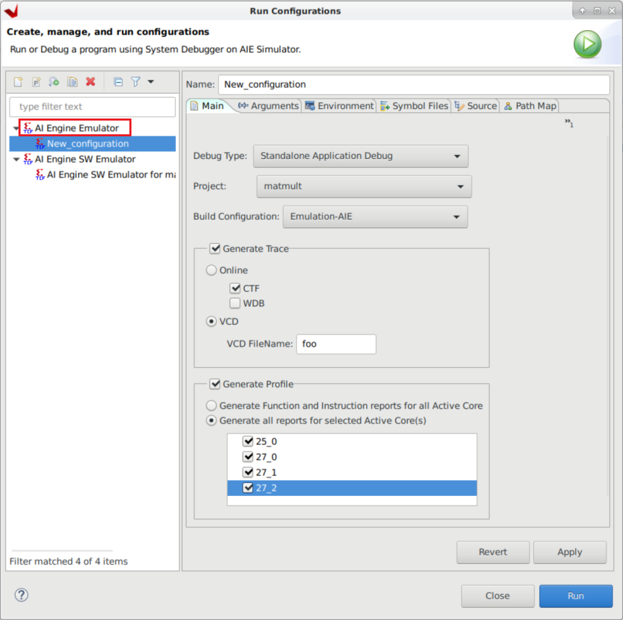
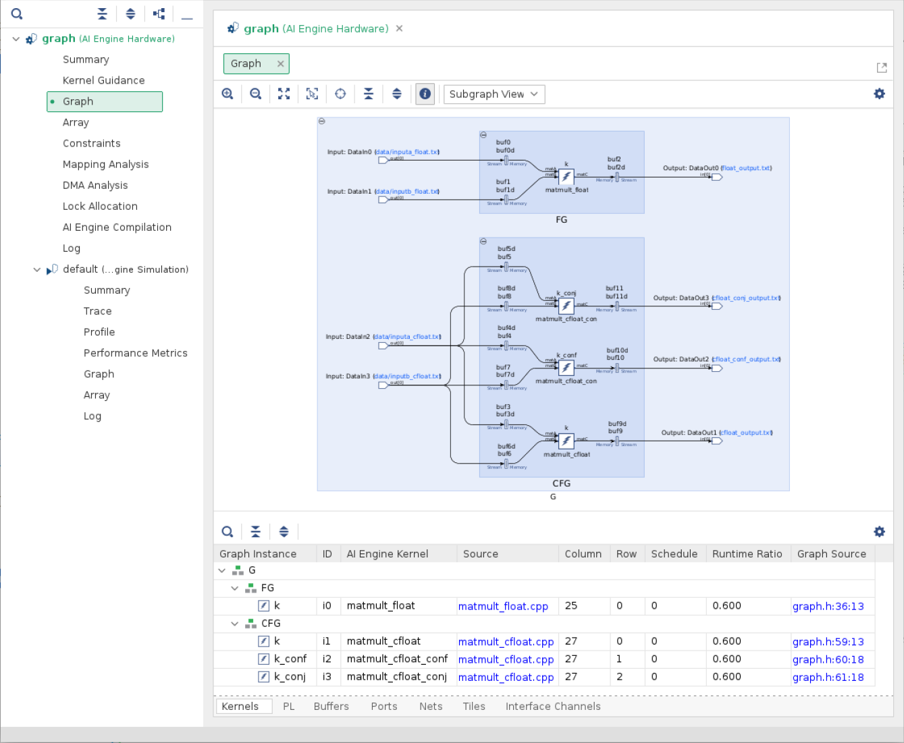

# Matrix Multiplication lab

## Introduction

This lab guides you through the steps involved in creating a floating point Matrix Multiplication kernel.

### References

[https://en.wikipedia.org/wiki/Matrix_multiplication](https://en.wikipedia.org/wiki/Matrix_multiplication)

[https://en.wikipedia.org/wiki/Matrix_multiplication#Complex_conjugate](https://en.wikipedia.org/wiki/Matrix_multiplication#Complex_conjugate)

## Description of the lab

<!-- Based on https://github.com/Xilinx/Vitis-Tutorials/tree/2022.2/AI_Engine_Development/Feature_Tutorials/07-AI-Engine-Floating-Point/MatMult
-->


## Steps

### Create a Vitis Project for the VCK5000 Versal Development Card

1. Verify that the tools and VCK5000 platform are setup correctly [here](setup_xup_tutorial.md#verifying-tools-installation)

1. In the Vitis GUI create a new application project

   * Platform: xilinx_vck5000_gen4x8_xdma_2_202210_1
   * Name: matmult
   * Processor: ai_engine
   * Domain: ai_engine
   * Acceleration templates: Empty Application

### Add source code for the AI Engine domain

1. In the Explore pane, right-click `matmult [ aie_domain ]`, then select *Import Sources...*

1. In the Import Source window, click *Browse...*, then navigate to `xup_aiengine_training/sources/matmult_lab/aie` and click *Open*.

1. Tick the *aie* box, then update the field *Into folder:* **matmult**

1. In the Explore pane, expand `matmult [ aie_domain ] > data` and `matmult [ aie_domain ] > src`

   Review the source files

1. In the Explore pane, double-click `matmult [ aie_domain ] > matmult.prj`

1. In the Application Project Settings window, select the *Top-Level File*

1. In the File selection window, expand `matmult > src` and select **graph.cpp**, then click *OK*

### Compile AI Engine kernel for Software Emulation

We are going to compile the AI Engine kernel and run software emulation to verify code correctness.

1. In the Application Project Settings window, set the active build configuration *Emulation-SW*

1. In the Explore pane, right-click on `matmult [ aie_domain ]` and then select *Build Project*

### Run SW Emulation - x86 Simulation

Software emulation (x86 Simulation) uses the files in the data folder as stimuli. We will get an output file with the results.

1. In the Explore pane, right-click on `matmult [ aie_domain ]` and then select *Run As > Launch SW Emulator*.

1. Once the simulation is completed, in the Explore pane, select at the same time both `matmult [ aie_domain ] > data > ref_outputc_float.txt` and `matmult [ aie_domain ] > Emulation-SW > x86simulator_output > float_output.txt`. Then, right-click on one of them and select *Compare With > Each Other After Transformation*

1. In the *Extra transformation commands* window, enter the following command to remove timestamps and to remove the extra spaces, then click *OK*

   ```console
   grep -v T {0} | sed "s/^[ \t]*//"  | sed "s/[ ^t]*$//" > {0}2 && mv {0}2 {0}
   ```
1. A windows reporting differences will appear, this is due to the fact that AIE uses scientific notation. At this point in time, there is no way of changing this format.

   Note that the numbers are the same, only expressed in a different notation.
<!-- https://jira.xilinx.com/browse/CR-1136529  to be fixed 2023.1 -->

### Compile and run AIE Simulation

This is still a software emulation (AIE Simulation), however the simulation takes into account the actual AI Engine array architecture. The AIE Simulation also uses files as input/outputs.

1. In the Application Project Settings window, set the active build configuration *Emulation-AIE*

1. In the Explore pane, right-click on `matmult [ aie_domain ]` and then select *Build Project*

   This compilation takes around 3-4 minutes

1. In the Explore pane, right-click on `matmult [ aie_domain ]` and then select *Run As > Run Configurations...*

1. Double-click on the AI Engine Emulator. This will create a new run configuration

1. Select: Generate Trace, Generate Profile, Generate all reports for selected Active Cores(s) and tick all cores.

   

1. Click `Apply` and then `Run`

   The simulation takes around 4-5 minutes

1. In the Explore pane, select at the same time both `matmult [ aie_domain ] > data > ref_outputc_float.txt` and `matmult [ aie_domain ] > Emulation-AIE > aiesimulator_output > float_output.txt`. Then, right-click on one of them and select *Compare With > Each Other After Transformation*

1. In the *Extra transformation commands* window, enter the following command to remove timestamps and to remove the extra spaces, then click *OK*

   ```console
   grep -v T {0} | sed "s/^[ \t]*//"  | sed "s/[ ^t]*$//" > {0}2 && mv {0}2 {0}
   ```

1. A windows reporting differences will appear, this is due to the fact that AIE uses scientific notation. At this point in time, there is no way of changing this format.

   Note that the numbers are the same, only expressed in a different notation.
<!-- https://jira.xilinx.com/browse/CR-1136529  to be fixed 2023.1 -->

### Explore AIE Graph with Vitis Analyzer

1. In the Assistant pane, double-click `matmult_system [System] > matmult [AIE] > Emulation-AIE > Run Summary (default)`

   

1. In the Vitis Analyzer open the `Graph` tab

1. Note that there are 2 subgraphs. FG for floating point matrix multiplication, and CFG for complex floating point matrix multiplication

   

1. Questions for the reader

   Q1: How many AI Engine tiles are used? Where are they placed?

   Q2: How many buffers are used? Where are they placed? What is their size?

   Q3: Is any AI Engine tiles only used for its memory?

   Q4: What is the AI Engine Frequency?

   Answers in the [appendix](#appendix)

1. Recommended exploration for curious readers

   E1: Explore the `Profile` tab to find out more execution information in each AI Engine tile
<!-- AI Engine names still show math_engine -->

   E2: Explore the Intermediate Representation of the code for each AI Engine tile. In Vitis, open the file `Emulation-AIE > Work > aie > ir > 25_0.ll`

   E3: Explore the assembly code for each AI Engine tile. In Vitis, open the file `Emulation-AIE > Work > aie > 25_0 > Release > 25_0.lst`

## Build for hardware

### Add Hw Kernel Project

1. In the Explore pane, right-click `mamtmult_system` and select *Add Hw Kernel Project...*

1. In the New Vitis IDE Project window, enter `matmult_pl` as *Hw Kernel project name:*, then click *Finish*

1. Right-click on the new created `matmult_pl > src` folder, then select `Import Sources...`

1. In the Import Source window, click *Browse...*, then navigate to `xup_aiengine_training/sources/matmult_lab/pl` and click *Open*.

1. Tick the *pl* box, then update click *Finish*

1. In the Explore pane, double-click `matmult_pl.prj`

1. In the Hardware Kernel Project Settings, click the `Add Hardware Function...` button

1. In the Add Hardware Function window, select both `mm2s` and `s2mm` and then click *OK*

### Add kernel linking file

We need to specify how the streaming interfaces of our kernels are going to be connected to the AI Engine array.

1. In the Explore pane, right-click on `matmult_system_hw_link`, then select *Import Sources...*

1. In the Import Source window, click *Browse...*, then navigate to `xup_aiengine_training/sources/matmult_lab/hw_link` and click *Open*.

1. Tick the *hw_link* box

1. Enter **matmult_system_hw_link/** in *Into folder:*, then click *Finish*

1. In the Explore pane, double-click `matmult_system_hw_link > matmult_system_hw_link.prj`

1. In the Hardware Link Project Settings, increase the mm2s and s2mm compute units to 4

1. Right-click on the binary_container_1, , and select *Edit V++ Options...*

1. In the `V++ command line options`: add `--config ../config.cfg` then click *Apply and Close*

### Add host code

1. In the Explore pane, right-click `matmult_system` and select *Add Application Project...*

1. In the New Vitis IDE Project window, enter `host` as *Application project name:*, select the x86 SMP processor and finally click *Next >*

1. In the Template window, select `Empty Application` then click *Next >*

1. In the Explore pane, right-click on `host [x86]`, then select *Import Sources...*

1. In the Import Source window, click *Browse...*, then navigate to `xup_aiengine_training/sources/matmult_lab/x86` and click *Open*.

1. Tick the *host.cpp* box, then click *Finish*

### Configure x86 compilation

1. In the Explore pane, right-click on `host [x86]`, then select *C/C++ Build Settings...*

1. Select All configurations

1. In `GCC Host Compiler (x_86_64) > Dialect` add `-std=c++17` in the Other dialect flags

   

1. Select `GCC Host Linker (x_86_64) > Libraries`

   Add the following libraries, under Libraries (-l)

   `adf_api_xrt`

   `xrt_coreutil`

   Add the following path, under search path (-L)

   `${env_var:XILINX_VITIS}/aietools/lib/lnx64.o`

   

1. Finally, click *Apply and Close*

### Build for HW & Run

1. In the Explore pane, double-click on `matmult_system.sprj`

1. Select `Hardware` as the active build configuration

1. In the Explore pane, right-click on the `matmult_system` then select *Build Project*

   This process takes around 80 minutes.

1. Run!

   The runs reports the execution time for a pure software matrix multiplication and the AI Engine execution time (note that this includes data transfers).

1. For XUP internal training, follow [these steps](run_labs_xup_internal.md#matmult-lab)

## Appendix

### Answers

Q1: Four AI Engines are used

| ID | Kernel             | Column | Row |
|----|--------------------|--------|-----|
| i0 | matmult_float      | 25     | 0   |
| i1 | matmult_cfloat     | 27     | 0   |
| i2 | matmult_float_conf | 27     | 1   |
| i3 | matmult_float_conf | 27     | 2   |

Q2: Four AI Engines are used

| ID    | Column | Row | Bank(s) | Size |
|-------|--------|-----|---------|------|
| buf0  | 24     | 0   | 2&3     | 512  |
| buf1  | 25     | 0   | 2&3     | 256  |
| buf2  | 25     | 0   | 0&1     | 512  |
| buf3  | 26     | 0   | 2&3     | 512  |
| buf4  | 27     | 1   | 1&2     | 512  |
| buf5  | 27     | 3   | 2&3     | 512  |
| buf6  | 26     | 0   | 0&1     | 128  |
| buf7  | 27     | 0   | 1&3     | 128  |
| buf8  | 27     | 3   | 0&1     | 128  |
| buf9  | 27     | 0   | 0&1     | 512  |
| buf10 | 27     | 0   | 1&2     | 512  |
| buf11 | 27     | 2   | 2&3     | 512  |

Q3: Yes, based on the tables above, you can see that AI Engine tile (24,0) and (26,0) are used only for its memory. Two memory banks of AI Engine tile (24,0) and four memory banks of AI Engine tile (26,0) are used.

Q4: 1250 MHz. Find this in Vitis Analyzer: `default (AI Engine Simulation) > Summary`

---------------------------------------
<p align="center">Copyright&copy; 2022 Advanced Micro Devices</p>